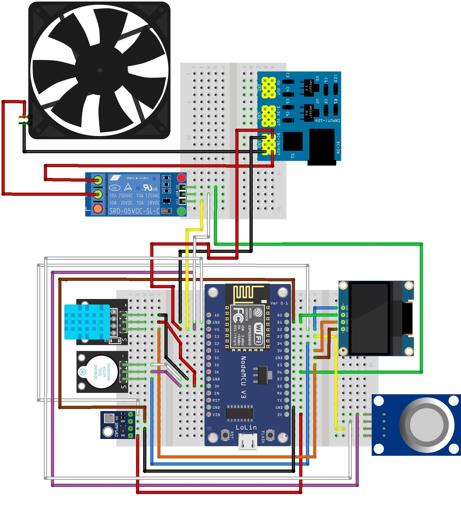
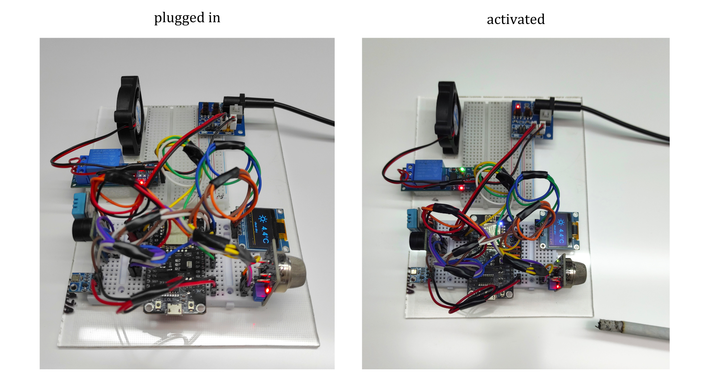
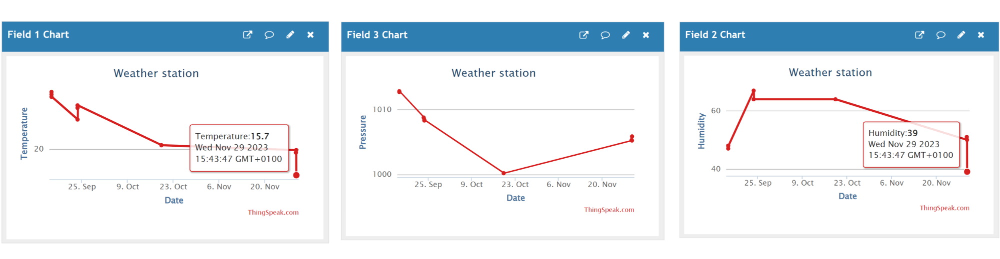
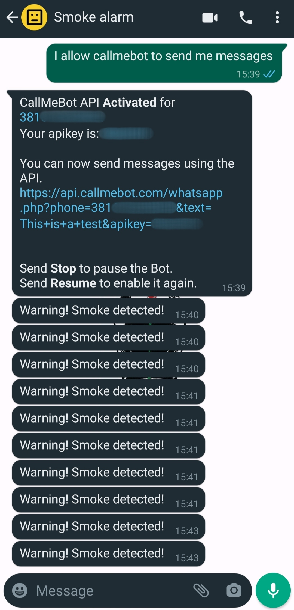

  <h1>Air-Safety System </h1>
<h3> <i> IoT-based system for real-time monitoring of temperature, air humidity, and pressure with the support of smoke detection </i> </h3>

 The system is based on collecting weather data from sensors, displaying it on the screen, and storing it on the ThingSpeak platform. 
 Also, the OpenWeather platform provides additional weather parameters to the A-S System, which is visible on the display.
 When the smoke sensor detects smoke, an alarm is triggered and the user receives a warning message on the WhatsApp application.
 The fan neutralizes the smoke.
 

   <h3> PROJECT LAYOUT </h3>
   

     

         
     

     

        
     

     

         
     

       
   

